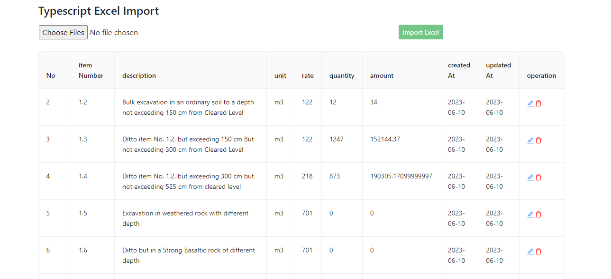
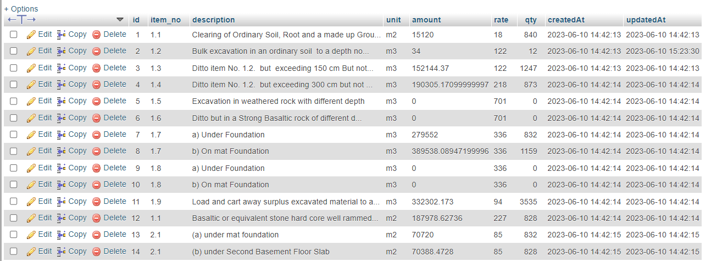
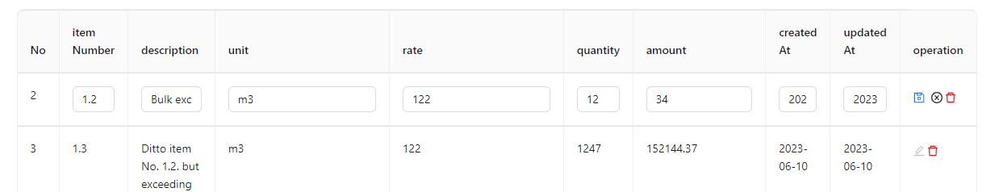
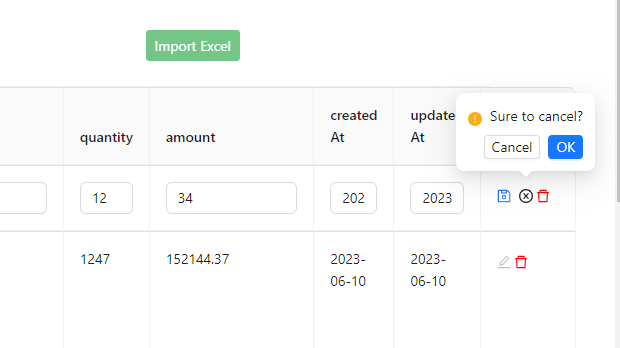

# Excel import using full stack typescript

set up database for backend 
```
NODE_ENV=development
DB_NAME=excel
DB_USER=root
DB_HOST=localhost
DB_DRIVER=mysql
DB_PASSWORD=""
TEST_DB_NAME=cookbook_test
```
To compile your typescript use below command 

```
npx tsc
```
Then specify main javascript file 
```
  "main": "dist/server/index.js",
  ```
In the project directory run 

```
npm install
# or
yarn install
```
This will install libraries  for server side 

Then use below command start your sever 
```
npm start
# or
yarn start
```

To move to client side use command 

```
cd client 
```

after moving to client use command 

```
npm install
# or
yarn install
```
Then use below command to serve you app to browse
```
npm start
# or
yarn start
```
change port for both backend and frontned from respective .env file 
```
PORT=xxxx
```

# Main ui with record 

# MySQL database record 

# On edit

# on delete

 

 