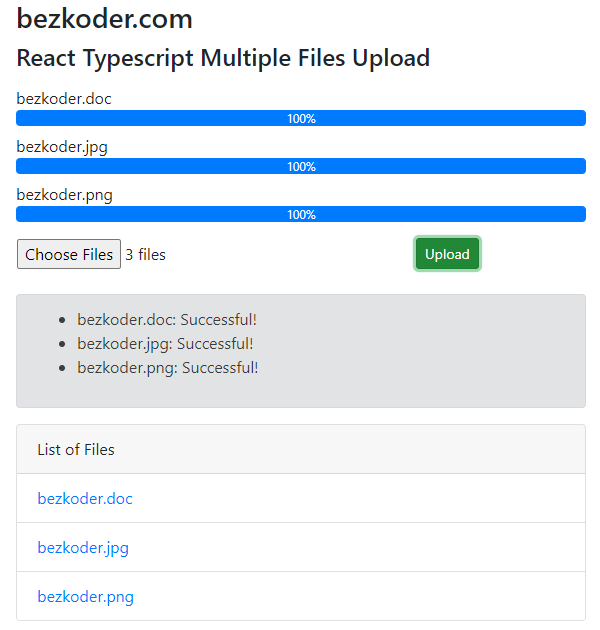

# Excel import using full stack typescript




For instruction, please visit:
> [React Typescript Multiple File Upload example](https://www.bezkoder.com/react-multiple-file-upload-typescript/)

### Set port
.env
```
PORT=8081
```

## Project setup

In the project directory, you can run:

```
npm install
# or
yarn install
```

or

### Compiles and hot-reloads for development

```
npm start
# or
yarn start
```

Open [http://localhost:8081](http://localhost:8081) to view it in the browser.

The page will reload if you make edits.
